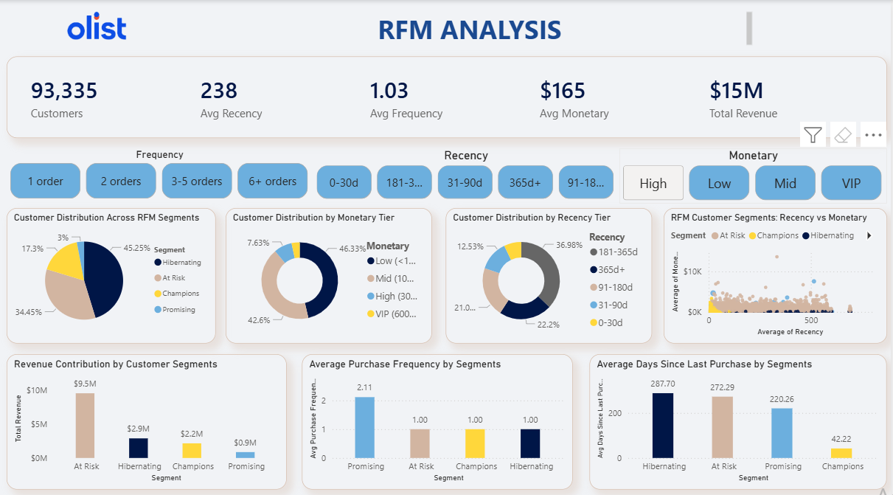

# 🛒 Olist RFM Customer Segmentation Analysis


> End-to-end customer segmentation pipeline using RFM (Recency, Frequency, Monetary) analysis and K-Means clustering on the Olist Brazilian e-commerce dataset, visualized in Power BI.

---

## 📋 Table of Contents

- [Project Overview](#project-overview)
- [Dataset](#dataset)
- [Project Structure](#project-structure)
- [Workflow](#workflow)
  - [1. Data Loading](#1-data-loading)
  - [2. Data Merging](#2-data-merging)
  - [3. Data Cleaning](#3-data-cleaning)
  - [4. RFM Feature Engineering](#4-rfm-feature-engineering)
  - [5. Scaling](#5-scaling)
  - [6. Elbow Method](#6-elbow-method)
  - [7. K-Means Clustering](#7-k-means-clustering)
  - [8. Segment Labeling](#8-segment-labeling)
  - [9. Export for Power BI](#9-export-for-power-bi)
- [Power BI Dashboard](#power-bi-dashboard)
- [Key Findings](#key-findings)
- [Requirements](#requirements)
- [How to Run](#how-to-run)

---

## 📌 Project Overview

This project segments customers of the Olist e-commerce platform into meaningful behavioral groups using RFM analysis combined with unsupervised machine learning (K-Means clustering). The goal is to help the business understand **who their customers are**, **how valuable they are**, and **what actions to take** for each group.

**RFM stands for:**
- **Recency** — How recently did the customer place an order?
- **Frequency** — How many orders have they placed?
- **Monetary** — How much total money have they spent?

---

## 📦 Dataset

The project uses 3 processed CSV files from the Olist dataset:

| File | Description | Key Columns |
|---|---|---|
| `orders_cleaned.csv` | Order-level data | `order_id`, `customer_id`, `order_status`, `order_purchase_timestamp` |
| `customers_cleaned.csv` | Customer mapping | `customer_id`, `customer_unique_id`, `customer_state` |
| `payments_order_level.csv` | Payment aggregated per order | `order_id`, `total_value`, `num_payments`, `payment_types` |

> **Source:** [Olist Brazilian E-Commerce Dataset — Kaggle](https://www.kaggle.com/datasets/olistbr/brazilian-ecommerce)

---

## 🗂️ Project Structure

```
project/
│
├── Data/
│   └── processed/
│       ├── orders_cleaned.csv
│       ├── customers_cleaned.csv
│       ├── payments_order_level.csv
│       └── rfm_segments.csv              ← Output: used in Power BI
│
├── Notebooks/
│   └── 01_RFM_Analysis.ipynb             ← Full analysis notebook
│
├── powerbi/
│   └── 01_RFM_Analysis.pbix                ← Power BI Desktop source file
│
├── rfm_analysis.py                       ← Standalone script to produce CSV
└── README.md
```

---

## 🔄 Workflow

### 1. Data Loading

Three datasets are loaded: orders, customers, and payments.

```python
orders    = pd.read_csv('Data/processed/orders_cleaned.csv')
customers = pd.read_csv('Data/processed/customers_cleaned.csv')
payments  = pd.read_csv('Data/processed/payments_order_level.csv')
```

---

### 2. Data Merging

The three datasets are merged into a single dataframe using `customer_id` and `order_id` as join keys.

```python
df = orders.merge(customers, on='customer_id', how='left') \
           .merge(payments,  on='order_id',    how='left')
```

**Result:** 99,418 rows × 20 columns

---

### 3. Data Cleaning

Several cleaning steps were applied:

- **Date columns** converted from string to `datetime64`
- **`late_delivery`** converted to boolean
- **`num_payments`** converted to `Int64`
- **Filtered to `delivered` orders only** — removed canceled, shipped, and other statuses (kept 96,455 rows)
- **Kept only 4 columns** relevant to RFM: `customer_unique_id`, `order_id`, `order_purchase_timestamp`, `total_value`
- **Dropped 1 row** with a missing `total_value`

```python
df = df[df['order_status'] == 'delivered'].copy()
df = df.dropna(subset=['total_value']).reset_index(drop=True)
```

**Final clean shape:** 96,454 rows × 4 columns, 0 missing values

---

### 4. RFM Feature Engineering

A snapshot date (1 day after the last order) is used as the reference point for Recency calculation. Each customer is aggregated into one row.

```python
snapshot_date = df['order_purchase_timestamp'].max() + pd.Timedelta(days=1)

rfm = df.groupby('customer_unique_id').agg(
    Recency   = ('order_purchase_timestamp', lambda x: (snapshot_date - x.max()).days),
    Frequency = ('order_id', 'nunique'),
    Monetary  = ('total_value', 'sum')
).reset_index()
```

| Metric | Description | Range in data |
|---|---|---|
| Recency | Days since last purchase | 1 – 713 days |
| Frequency | Number of unique orders | 1 – 15 orders |
| Monetary | Total spend across all orders | ~9 – 13,664 BRL |

**Result:** 93,335 unique customers

---

### 5. Scaling

Raw RFM values cannot be fed directly into K-Means because the ranges are vastly different (Monetary goes up to 13,000 while Frequency maxes at 15). Two steps are applied:

**Step 1 — Log Transform (`log1p`)**
Compresses the right-skewed distributions of Frequency and Monetary.

```python
rfm_log['Recency']   = np.log1p(rfm['Recency'])
rfm_log['Frequency'] = np.log1p(rfm['Frequency'])
rfm_log['Monetary']  = np.log1p(rfm['Monetary'])
```

**Step 2 — StandardScaler**
Normalizes all features to mean=0 and standard deviation=1, so no single feature dominates the clustering.

```python
scaler     = StandardScaler()
rfm_scaled = scaler.fit_transform(rfm_log)
```

---

### 6. Elbow Method

To find the optimal number of clusters (K), inertia (within-cluster sum of squares) is plotted for K = 2 through 10. The "elbow" — where the curve bends and flattens — indicates the best K.

```python
for k in range(2, 11):
    km = KMeans(n_clusters=k, random_state=42, n_init=10)
    km.fit(rfm_scaled)
    inertias.append(km.inertia_)
```

**K=4 was selected** based on the elbow plot.

---

### 7. K-Means Clustering

K-Means groups the 93,335 customers into 4 clusters by finding the assignment that minimizes the distance between each customer and their cluster's center point (centroid).

```python
kmeans = KMeans(n_clusters=4, random_state=42, n_init=10)
rfm['Cluster'] = kmeans.fit_predict(rfm_scaled)
```

The algorithm:
1. Randomly places 4 centroids in the RFM space
2. Assigns every customer to their nearest centroid
3. Moves each centroid to the average of its assigned customers
4. Repeats steps 2–3 until stable

---

### 8. Segment Labeling

Each cluster is automatically labeled based on its mean RFM profile. A scoring formula ranks clusters by desirability:

```python
profile['score'] = -profile['R'] + profile['F'] * 50 + profile['M'] / 10
```

Low Recency (recent) + High Frequency + High Monetary = best score = **Champions**

| Segment | Recency | Frequency | Monetary | Strategy |
|---|---|---|---|---|
| 🏆 Champions | Low (recent) | High | High | Reward & retain |
| 🌱 Promising | Low (recent) | Low | Medium | Encourage repeat purchase |
| ⚠️ At Risk | High (inactive) | Medium | Medium | Win-back campaign |
| 💤 Hibernating | Very high | Low | Low | Discount or deprioritize |

---

### 9. Export for Power BI

Three extra categorical columns are added before export to make Power BI slicers easier to build without DAX:

```python
rfm['Recency_Band']    # 0-30d / 31-90d / 91-180d / 181-365d / 365d+
rfm['Frequency_Band']  # 1 order / 2 orders / 3-5 orders / 6+ orders
rfm['Monetary_Tier']   # Low / Mid / High / VIP

rfm.to_csv('../Data/processed/rfm_segments.csv', index=False)
```

**Final CSV columns:**

| Column | Type | Description |
|---|---|---|
| `customer_unique_id` | string | Unique customer identifier |
| `Recency` | int | Days since last order |
| `Frequency` | int | Number of orders |
| `Monetary` | float | Total spend (BRL) |
| `Cluster` | int | Cluster number (0–3) |
| `Segment` | string | Champions / Promising / At Risk / Hibernating |
| `Recency_Band` | category | Recency bucket for slicers |
| `Frequency_Band` | category | Frequency bucket for slicers |
| `Monetary_Tier` | category | Monetary bucket for slicers |

---

## 📊 Power BI Dashboard

The final dashboard was built in Power BI Desktop using `rfm_segments.csv` as the single data source.



### Visuals built:

| Visual | Type | Columns used |
|---|---|---|
| KPI Cards | Card | COUNT of customers, AVG Recency, AVG Frequency, AVG Monetary, SUM Monetary |
| Segment Distribution | Donut chart | `Segment` |
| Monetary Tier Distribution | Donut chart | `Monetary_Tier` |
| Recency Tier Distribution | Donut chart | `Recency_Band` |
| Recency vs Monetary | Scatter chart | `Recency`, `Monetary`, `Segment` |
| Revenue by Segment | Bar chart | `Segment`, `Monetary` (SUM) |
| Avg Frequency by Segment | Bar chart | `Segment`, `Frequency` (AVG) |
| Avg Recency by Segment | Bar chart | `Segment`, `Recency` (AVG) |
| Slicers | Slicer | `Frequency_Band`, `Recency_Band`, `Monetary_Tier` |

---

## 🔍 Key Findings

- **93,335** unique customers analyzed across **713 days** of order history
- **45.25%** of customers fall in the **Hibernating** segment — the largest group, last purchased long ago with low spend
- **At Risk** customers contribute the most revenue (**$9.5M**) despite being inactive — a strong win-back opportunity
- **Champions** (3%) have the lowest average recency (**42 days**) and highest frequency (**2.11 orders**) — highly engaged customers
- **Promising** customers have an average recency of only **220 days** — good candidates for re-engagement campaigns
- Over **90,000 customers** placed only 1 order, confirming very low repeat purchase rates — a key business problem to address

---

## ⚙️ Requirements

```
pandas
numpy
scikit-learn
matplotlib
seaborn
```

Install with:
```bash
pip install pandas numpy scikit-learn matplotlib seaborn
```

---

## ▶️ How to Run

### Python — Generate the RFM CSV

**Option 1 — Run the Python script directly:**
```bash
python 01_RFM_Analysis.py
```

**Option 2 — Run the Jupyter notebook:**
```bash
jupyter notebook Notebooks/01_RFM_Analysis.ipynb
```

Both produce `../Data/processed/rfm_segments.csv`.

---

### Power BI — Open the Dashboard

> ⚠️ **Note:** This dashboard was built and is shared as a local `.pbix` file. It has **not been published to Power BI Service** because the account used is on the **free tier**, which does not support online publishing or sharing via link.

**To open and explore the dashboard:**

1. Download and install **[Power BI Desktop](https://powerbi.microsoft.com/desktop/)** (free, Windows only)
2. Open Power BI Desktop
3. Go to `File → Open report → Browse`
4. Navigate to the `powerbi/` folder in this project
5. Select `rfm_dashboard.pbix` and click **Open**

**If the data doesn't load automatically (broken data source path):**

1. In Power BI Desktop, go to `Home → Transform data → Data source settings`
2. Click `Change Source`
3. Point the file path to your local `Data/processed/rfm_segments.csv`
4. Click `Close & Apply`

The dashboard will refresh with your local data automatically.

---

---

*Analysis by **Phone Thet Pai***